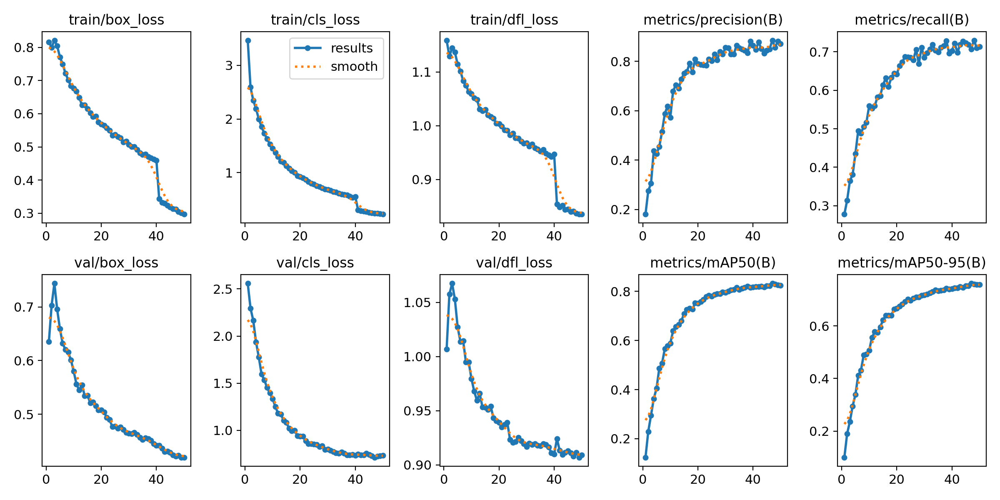
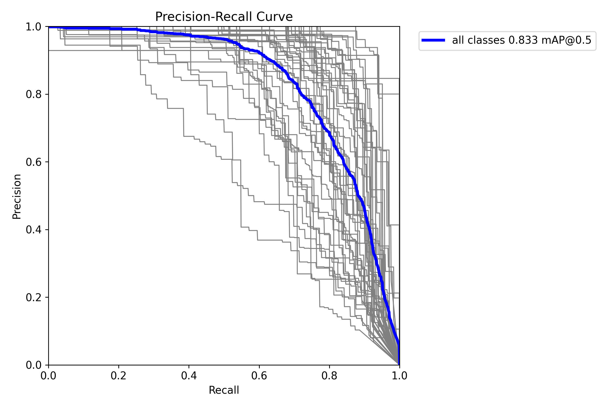
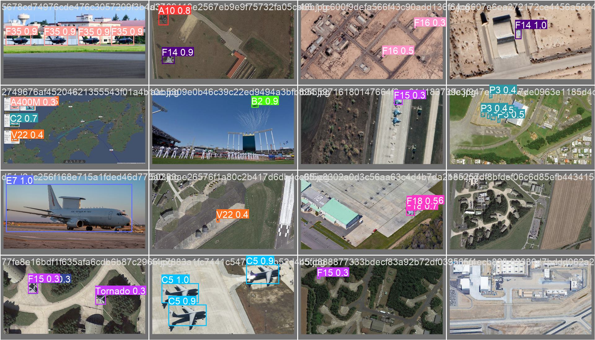

# yolo-mil-air
Training a YOLOv8 medium model to detect and classify military aircraft photos. 

# Dataset
We provide 45 total different fighter jets to YOLO for object detection. The model is trained on over 9000 images using mosaic augmentation and basic image processing techniques and is validated using about 1800 images. 

# Results 

# Precision-Recall Curve

# Sample Validation Images

